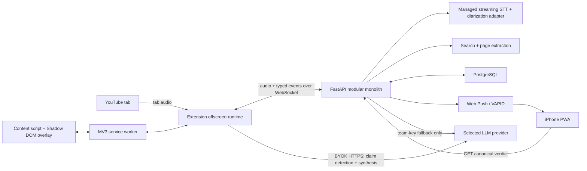

# Verity — High-Level MVP Implementation Plan

## 1. Delivery objective

Build one reliable vertical slice:

> A viewer starts Verity on a two-person YouTube video, sees a factual claim detected and checked, leaves the tab, then opens a cited verdict from an iPhone notification within 45 seconds.

Optimize for demo reliability, evidence transparency, and a credible path to production—not broad platform coverage.

## 2. Architectural principles

1. **One deployable backend.** Keep transcription orchestration, search, evidence validation, persistence, and push delivery in one FastAPI service.
2. **Pipeline roles, not microservices.** “Agents” are typed async functions that can run concurrently; no agent framework or distributed queue is required for the MVP.
3. **One canonical claim record.** The overlay, PWA, notification, and audit trail all read the same server-side claim/verdict state.
4. **Structured outputs at every AI boundary.** Models return schema-validated JSON, never UI-ready prose blobs.
5. **Deterministic trust checks after AI.** Code validates citation IDs, excerpts, source count, verdict enum, and confidence range.
6. **Privacy by minimization.** Do not store raw audio. Persist only the claim-relevant transcript, evidence, and verdict with a short retention policy.
7. **BYOK stays client-side.** The extension calls the selected model provider directly; Verity's backend never receives the user's API key.
8. **Design the fallback before the demo.** Cached transcript/evidence can replace a failed external dependency while preserving the same state transitions.

## 3. Minimal architecture



### Deployables

- **Chrome extension:** React/TypeScript/Vite, Manifest V3, minimum Chrome 116.
- **PWA:** React/TypeScript/Vite, installable manifest and service worker.
- **API:** FastAPI container with WebSocket and REST endpoints.
- **Database:** Managed PostgreSQL. Enable pgvector, but keep it off the critical path until semantic cache lookup is added.
- **Infrastructure:** DigitalOcean App Platform, managed database, HTTPS, and environment-managed team/VAPID secrets.

Do not add Redis, Kafka, Celery, Kubernetes, or separately deployed agent services for the hackathon.

## 4. Repository shape

```text
verity/
  apps/
    extension/            # overlay, service worker, offscreen audio, BYOK
    pwa/                  # pairing, push opt-in, verdict page
  services/
    api/
      app/
        api/              # REST and WebSocket transport
        pipeline/         # transcript, claim, evidence, verdict stages
        providers/        # STT, search, LLM fallback, Web Push adapters
        domain/           # state machine and validation rules
        persistence/      # PostgreSQL repositories
  packages/
    contracts/            # generated TypeScript client/types from OpenAPI
    ui/                   # only truly shared verdict components/tokens
  infra/
    app.yaml              # DigitalOcean App Platform specification
  fixtures/
    hero-demo/            # disclosed cached transcript/evidence/verdict
```

Use a monorepo, one lockfile for TypeScript apps, and one Python dependency definition. Generate frontend API types from FastAPI's OpenAPI schema instead of maintaining duplicate interfaces.

## 5. Runtime responsibilities

### Extension

- **Service worker:** handles the start/stop gesture, creates the offscreen document, routes extension messages, and restores session state.
- **Offscreen document:** owns the tab `MediaStream`, preserves audible playback through `AudioContext`, encodes 1-second Opus chunks, maintains the WebSocket, and performs direct BYOK model calls.
- **Content script:** mounts a single isolated Shadow DOM overlay on YouTube and renders server state; it performs no orchestration.
- **Settings page:** provider URL, API key, fast/reasoning model, spending limit, connection test, delete key, and disclosed demo fallback.

### FastAPI modular monolith

- **Session gateway:** authenticates a short-lived demo session and multiplexes audio, transcript, claim, and verdict events over one WebSocket.
- **Transcription adapter:** sends audio to a managed realtime STT service with speaker diarization. Do not host speech or diarization models during the hackathon.
- **Claim coordinator:** assembles complete sentences and asks the extension's fast-model adapter to classify only checkable factual claims.
- **Evidence pipeline:** plans neutral and counter queries, searches concurrently, extracts passages, ranks source quality, and deduplicates URLs.
- **Verdict coordinator:** asks the extension's reasoning-model adapter for a structured verdict, then applies deterministic validation.
- **Persistence:** stores canonical claim state, evidence, verdict, pairing, and push subscription records.
- **Notification service:** sends one completion notification whose URL contains the claim's unguessable public ID.

### PWA

- Pair with the desktop using a short-lived six-digit code or QR URL.
- Explain that iPhone push requires installation to the Home Screen.
- Request notification permission only after the user taps **Enable notifications**.
- Render the canonical verdict response; do not duplicate verdict-generation logic.

## 6. Canonical pipeline

```text
CAPTURING
  → TRANSCRIBING
  → CLAIM_CANDIDATE
  → CHECKING
  → EVIDENCE_READY
  → SYNTHESIZING
  → COMPLETE | INSUFFICIENT_EVIDENCE | FAILED
```

1. The extension starts capture from an explicit user click.
2. The offscreen runtime streams audio chunks with session ID and monotonic sequence number.
3. STT emits final transcript segments: `{speaker, text, start_ms, end_ms}`.
4. Sentence assembly waits for a final segment or punctuation boundary.
5. The fast model returns `opinion | factual_claim | unverifiable`, a normalized exact claim, and neutral/support/counter search queries. Only `factual_claim` proceeds.
6. The backend creates the canonical claim record and immediately broadcasts `CHECKING`.
7. Two evidence roles run concurrently:
   - **Evidence:** search for the strongest support and context.
   - **Counterevidence:** search for credible contradiction, limitations, and missing context.
8. The backend fetches pages, extracts passages, applies source-quality rules, and assigns immutable evidence IDs.
9. The reasoning model may cite only those evidence IDs and returns the verdict contract as JSON.
10. Deterministic validation rejects nonexistent citations, unverifiable excerpts, invalid labels, and unjustified certainty.
11. The backend stores the completed verdict, broadcasts it to the overlay, and sends Web Push.
12. Desktop and mobile fetch `/v1/claims/{public_id}` and render the same data.

### Fail-closed rules

- Fewer than two credible independent sources: `Insufficient evidence`.
- Credible sources materially disagree: `Disputed`.
- A quoted excerpt cannot be found in captured page text: remove that citation.
- Required fields or citations fail validation: retry synthesis once, then fail closed.
- Common ground must be supported by the evidence bundle; otherwise omit it.

## 7. Minimal contracts

Use Pydantic models as the source of truth.

### Claim

```text
id, public_id, session_id, speaker_label, exact_text,
normalized_text, start_ms, end_ms, classification, state,
created_at, completed_at
```

### Evidence item

```text
id, claim_id, stance, title, canonical_url, publisher,
published_at, retrieved_at, excerpt, source_tier, content_hash
```

### Verdict

```text
claim_id, label, confidence, explanation, uncertainty,
counterevidence_summary, common_ground,
citation_ids[], model_provider, model_name, prompt_version
```

### Supporting records

- `sessions`: video URL/title, status, paired device ID, demo-mode flag.
- `push_subscriptions`: endpoint and encrypted subscription keys; deletable by device.
- `usage_ledger`: client-side estimate for BYOK; server-side metering for team-key fallback.

Raw audio is transient memory only. Retain claim-linked transcript and verdicts for the demo; add an automatic TTL before public testing.

## 8. API surface

Keep the public surface small:

```text
WS   /v1/sessions/{id}/stream       audio upload + pipeline events
POST /v1/sessions                   create session
POST /v1/sessions/{id}/claims       claim result from BYOK fast model
POST /v1/claims/{id}/verdict        verdict draft from BYOK reasoning model
GET  /v1/claims/{public_id}         canonical mobile/desktop verdict
POST /v1/pairings                    create/redeem short-lived pairing
POST /v1/push-subscriptions          register PWA subscription
DELETE /v1/push-subscriptions/{id}   revoke PWA subscription
GET  /healthz                        liveness
GET  /readyz                         database/provider readiness
```

WebSocket events are versioned envelopes with `type`, `schema_version`, `session_id`, `sequence`, and `payload`. Make creates idempotent so reconnects cannot duplicate claims or notifications.

## 9. BYOK design

### User-key mode

- Store the key only in `chrome.storage.local` for the prototype.
- Perform model requests from the offscreen extension context to the provider endpoint through explicit host permissions.
- Send only structured classification/verdict outputs to Verity.
- Enforce a client-side estimated monthly budget before each model request.
- Remove the key and derived configuration on **Delete key**.

### Team-demo mode

- Keep the team key in App Platform secrets.
- Perform the same model calls through the backend provider adapter.
- Mark the session and UI clearly as **Demo key**.
- Apply a strict server-side request and cost limit.

Run a day-zero compatibility spike against each supported provider: extension-origin HTTPS, endpoint shape, streaming behavior, model listing, and error handling. Do not advertise a provider until direct calls pass this test.

## 10. Latency and performance budget

Target a completed verdict in **30 seconds p95**, leaving 15 seconds of demo margin.

| Stage | Budget | Technique |
|---|---:|---|
| Sentence finalization + STT | 5 s | 1-second audio chunks; streaming STT |
| Claim classification | 2 s | small fast model; compact structured prompt |
| Query planning | 0 s added | emitted with the fast-model classification |
| Search + extraction | 10 s | concurrent queries; timeouts; first 3 credible sources win |
| Verdict synthesis | 7 s | compact evidence bundle; strict JSON schema |
| Validation, persistence, push | 4 s | one transaction; asynchronous push after commit |

Additional constraints:

- Cap evidence at six passages and three final citations.
- Bound every external call with a timeout and one retry with jitter.
- Use content hashes and canonical URLs to deduplicate evidence.
- Cache search/evidence by normalized claim hash; pgvector similarity is an optional later optimization.
- Apply WebSocket backpressure; drop stale partial transcripts before final segments.

## 11. Implementation sequence

### Phase 0 — Prove the risky edges

- Capture and replay YouTube tab audio from an MV3 offscreen document.
- Verify background-tab continuity and reconnect behavior.
- Verify managed STT speaker labels on the exact demo clip.
- Verify direct extension-origin BYOK calls for both providers.
- Install the PWA on the demo iPhone and prove a tap-open push.

**Exit:** each external boundary works independently on the actual demo devices.

### Phase 1 — Contract-first walking skeleton

- Create the monorepo, shared OpenAPI-generated types, database schema, and claim state machine.
- Implement fake adapters for STT, search, models, and push.
- Drive the entire overlay-to-phone flow with fixtures.

**Exit:** one button produces the complete hero flow without real providers.

### Phase 2 — Live transcript and claim detection

- Connect tab capture, audio WebSocket, managed STT, two-speaker display, and sentence assembly.
- Add fast-model fact/opinion classification and claim deduplication.

**Exit:** the target claim is detected once, with the correct speaker and timestamp.

### Phase 3 — Evidence and verdict

- Add parallel support/counter searches, page extraction, source tiers, and deduplication.
- Add schema-constrained synthesis and deterministic citation validation.
- Render uncertainty, counterevidence, and common ground in shared verdict components.

**Exit:** the target claim produces a valid verdict with 2–3 working citations in under 30 seconds.

### Phase 4 — Cross-device completion

- Add pairing, push subscription management, canonical public verdict URLs, and notification delivery.
- Confirm that processing continues when the YouTube tab loses focus.

**Exit:** the locked demo iPhone receives and opens the correct verdict.

### Phase 5 — BYOK, resilience, and deployment

- Complete settings, connection test, delete-key flow, budget guard, and team-key fallback.
- Add fixture fallback, provider timeouts, reconnect/idempotency, redacted logging, and health checks.
- Deploy from the main demo branch to App Platform and rehearse from a clean browser profile.

**Exit:** three consecutive end-to-end rehearsals pass without manual intervention.

## 12. Team execution

| Owner | Primary boundary | First integration contract |
|---|---|---|
| Tri | Extension, overlay, offscreen runtime, BYOK UI | WebSocket events + verdict schema |
| Moh | Audio transport, STT adapter, speaker tracking | Transcript segment schema |
| Jun | Claim prompts, search, evidence, synthesis | Evidence bundle + verdict draft |
| Arnav | API, database, PWA, push, deployment | Claim state machine + public verdict API |

Integration order is **contracts → fixtures → real adapters**. Each owner develops against the same hero-demo fixture so no workstream waits on another provider integration.

## 13. Verification strategy

- **Contract tests:** every model/provider response against Pydantic/JSON Schema.
- **Unit tests:** state transitions, source-tier rules, citation/excerpt validation, claim deduplication, and cost guards.
- **Adapter tests:** recorded provider responses; no live API dependency in normal CI.
- **Extension test:** Playwright loads the unpacked extension against a controlled local video page.
- **API integration test:** one fixture audio/session reaches a persisted verdict and mocked push.
- **Demo smoke test:** real YouTube clip, real providers, real iPhone, and a stopwatch.
- **Trust review:** manually confirm that each final excerpt exists at its URL and that the explanation does not overstate the evidence.

The primary release gate is three successful hero runs, not aggregate code coverage.

## 14. Observability and safety

- Generate one correlation ID per session and claim.
- Log state changes, stage latency, provider name, token/usage counts, source domains, and error codes.
- Never log audio bytes, API keys, full authorization headers, or complete provider request bodies.
- Add a global redaction filter for common secret fields before structured logs leave the process.
- Track: claim detection latency, verdict completion latency, insufficient-evidence rate, citation-validation failures, and push-delivery outcomes.
- Show visible **Listening**, **Checking**, **Completed**, and **Could not verify** states; never silently fail.

## 15. Highest risks and mitigations

| Risk | Mitigation |
|---|---|
| iPhone push is not ready during judging | Preinstall PWA; permission requires a user tap; test on venue network; keep a second subscribed device |
| MV3 capture stops | Chrome 116+; offscreen runtime owns capture/WebSocket; heartbeat and reconnect with sequence IDs |
| Speaker labels drift | Managed diarization; exactly two speakers; allow one manual A/B label correction before the demo |
| Search is slow or blocked | Hard timeouts, parallel queries, cached disclosed hero evidence |
| Model invents citations or quotes | Evidence IDs only; exact excerpt validation; fail closed |
| BYOK endpoint blocks extension calls | Day-zero compatibility gate; support only verified endpoints |
| YouTube DOM changes | Inject one Shadow DOM host with minimal dependence on player internals |
| Multi-instance WebSocket state breaks | Deploy one API instance for the hackathon; persist canonical state; add a durable queue only before horizontal scaling |

## 16. Post-MVP evolution

When real usage requires horizontal scale, keep the public contracts and replace only infrastructure behind them:

- Move pipeline jobs to a durable queue and stateless workers.
- Add Redis/pub-sub for WebSocket fan-out.
- Use encrypted, short-lived provider credentials and a formal secrets service.
- Add pgvector semantic claim reuse with freshness and source-version checks.
- Add more platforms and speakers through new capture/diarization adapters.
- Add source-governance workflows, audit exports, abuse controls, and measurable bias evaluations.

Do not start these until the hero loop is reliable and judges can inspect why a verdict was produced.

## 17. Definition of done

The MVP is complete when a clean Chrome profile and installed iPhone PWA can demonstrate, three times consecutively:

1. Explicit capture start on the chosen YouTube debate.
2. Stable two-speaker transcript.
3. Correct factual-claim trigger and visible checking state.
4. Background-tab continuation.
5. A validated, uncertain-when-appropriate verdict with 2–3 working sources.
6. A phone notification within 45 seconds that opens the same canonical verdict.
7. No user key, raw audio, or secret appears in backend persistence or logs.

## Platform constraints confirmed

- Chrome 116+ can obtain a tab-capture stream ID from the extension service worker and consume it in an offscreen document for background recording: [Chrome audio recording and screen capture](https://developer.chrome.com/docs/extensions/how-to/web-platform/screen-capture).
- Capturing tab audio stops its normal playback unless the captured stream is routed back to an audio output: [Chrome `tabCapture` reference](https://developer.chrome.com/docs/extensions/reference/api/tabCapture).
- iPhone Web Push requires a Home Screen web app, and notification permission must follow a direct user interaction: [WebKit Web Push for iOS and iPadOS](https://webkit.org/blog/13878/web-push-for-web-apps-on-ios-and-ipados/).
- App Platform container filesystems are ephemeral, so all canonical state belongs in PostgreSQL: [DigitalOcean App Platform limits](https://docs.digitalocean.com/products/app-platform/details/limits/).
